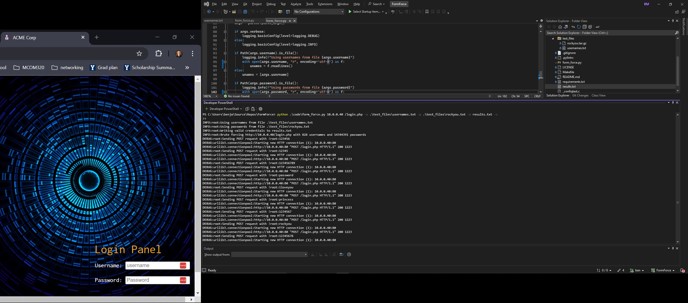

# FormForce

**A Brute Force Tool for Web Forms**

Contributers: Reilly McKendrick, Benjamin MacMichael, Sean Ronstadt

## Installation

To install FormForce, run:

make install

If you don't have `make` installed on your system and are using Windows PowerShell, you can run the following commands instead:

pip install pylint
pip install -r requirements.txt

## Testing

To run tests, execute:

make test

If you don't have `make` installed on your system and are using Windows PowerShell, run:

python -m unittest discover -s test -p "test_*.py"

However, the above will also run a large amount of other tests since our test inherits from the unittest class, so to only run the test we set up, you can 
run this command instead in powershell

python -m unittest tests.test_form_force.TestBruteForceForm.test_brute_force_valid_credentials

About the testing:
  * We have github actions setup to run pylint on every commit to the main branch. This checks for general python syntax errors and ensures that main code is always executable.
  * We have a unit test setup to do a basic check to make sure the http post request is working and that the reply is properly processed.
  * In test_files/ there is a username word list and password word list that we used to brute force attack the website form hosted by the Midterm 1 virtual machine. We manually verified a few of the passwords it found, such as admin:admin, to make sure it did not put out false positives. 
* See screenshots below of this app bruteforcing a webpage

## Brute Force Using Username and Password Files

## Brute Force Using Specific Credentials

## PHASE 2

We added 2 options to the form_force function: min_delay and max_delay. This allows the user to implement a random time between requests to avoid detection

## Brute Force Using Time Delay

## PHASE 3

We added an html page where a less tech-savvy user has a friendlier interface to input their options and have the command generated for them to copy and paste into powershell.
We also added multiprocessing to the program so that multiple jobs can be spawned to send and analyze username/password attempts.

## HTML Command Generation
